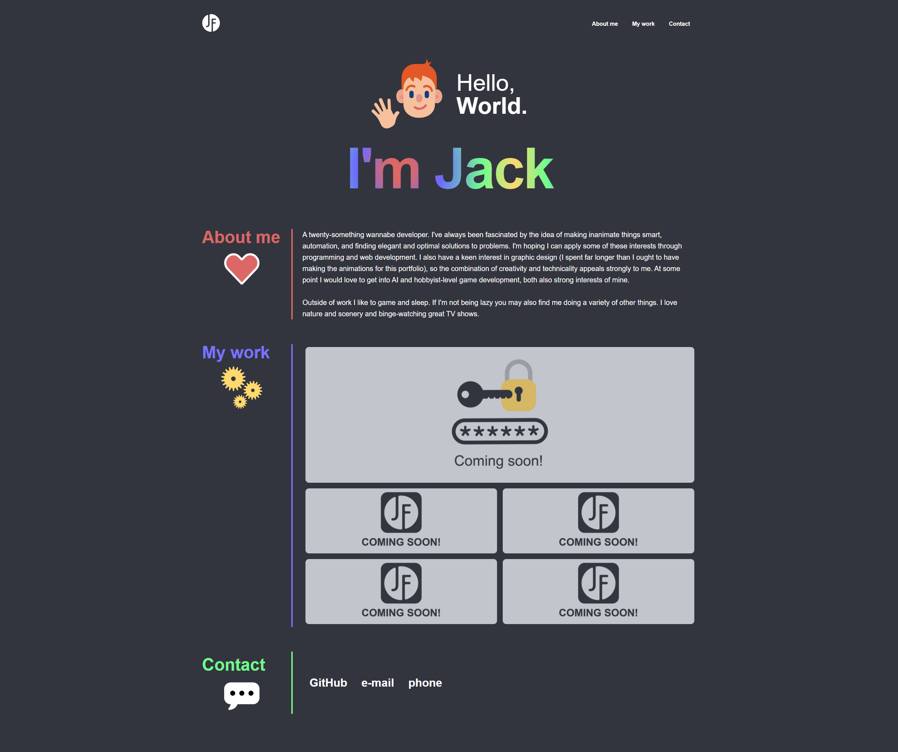
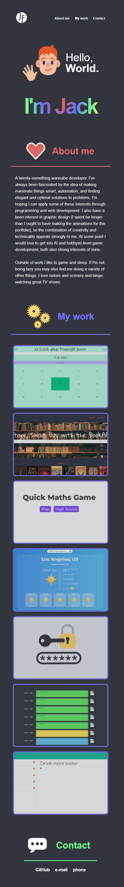

# Jack Franklin Portfolio

Every developer needs a portfolio. A place on the internet they call home, where they can flaunt their coding prowess and show off their works to the world. 

Well, I don't have any works to show off... but that's about to change very soon. Hence I have lovingly crafted this site.

## The process

I was given an example of how the portfolio should look and have thus based my design around that. I wanted to express some creative freedom, and so created various designs/wireframes using XD. It was incredibly helpful having a design to look at when I was doing the CSS. I will always create a wireframe for every site I do in the future.

## What did I learn?

A lot about flexboxes. At first it just wasn't clicking, and I was having trouble making my flex items fit. I then read a fantastic MDN article and I now have a much better understanding about how flex-basis affects item size, and also insight on taking into consideration the box model when designing.

I spent many, many hours on the animations. I knew I wanted to have them on my portfolio, but had zero prior knowledge. I have now learnt a good deal about them and using `@keyframes` and this is something I would like to pursue more. 

MY CSS isn't pretty: there's a lot of redundancy in there, and I faced many issues that I could not solve with Google, such as:

* A way to remove all styles from a class when a pseudo-class is activated, e.g. if you hover over a picture, all the styles associated with that picture are reset. I feel like this would be quite a useful feature. 

* I couldn't figure out why `:hover` was applying _some_ effects to my nav links, but not all of them. 

* An issue whereby an inital class had a `:first-child` pseudo-class applied, but in the media query this was still being applied despite a new style being applied to the entire class. I had to manually select the first-child again to create a new style.

And many more.

### Link to site 

https://bytemybits.github.io/Portfolio/

